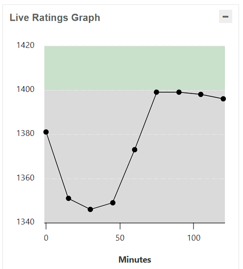

# 🏆 Contest Performance Report – CodeChef Starters 199 (Division 4)

**📅 Date:** 2025-08-13  
**🖥 Platform:** CodeChef (Division 4)  
**⚡ Contest Duration:** 2 hours  

---

## 📊 Rating Overview
| Metric           | Value      |
|------------------|------------|
| **Rating Before** | 1380       |
| **Rating After**  | 1396       |
| **Change**        | **+16** 📈 |
| **Global Rank**   | —          |

---

## 📈 Live Ratings Progress During Contest

**Observations:**
- **Start:** ~1380  
- **Early Drop:** Fell to ~1340 due to slow problem submissions (keyboard adaptation).  
- **Recovery:** Sharp climb after solving 2 problems back-to-back.  
- **Stability:** Maintained ~1400 rating in the final stretch.

---

## 🎯 Scorable Problems – Division 4

| # | Problem Name              | Code       | Score (%) | Attempts | Accuracy (%) |
|---|---------------------------|------------|-----------|----------|--------------|
| 1 | Cake Making               | CAKEMAKE   | 100/100   | 28,239   | 78.23        |
| 2 | Brick Comparisons         | STICKCOMP  | 100/100   | 24,799   | 75.40        |
| 3 | Fence Colouring           | FENCECOL   | 100/100   | 12,354   | 45.32        |
| 4 | Grid MEX                  | GRIDMEX    | 100/100   | 7,805    | 66.75        |
| 5 | Subtract or Divide        | SUBDIV     | ❌ 0/100  | 4,524    | 26.04        |
| 6 | Perfect Ranges            | PERRANGES  | ❌ 0/100  | 1,046    | 24.60        |
| 7 | XOR Game                  | XORGAME1   | ❌ 0/100  | 847      | 27.68        |
| 8 | Replace with Coefficients | REPCOEFF   | ❌ 0/100  | 1        | 0.04         |

---

## 💡 Key Learnings
1. **Keyboard Familiarity:** Early contest struggles were not due to problem difficulty but due to adapting to a **new keyboard**. This slowed typing and increased mistakes in early submissions.
2. **Steady Recovery:** Once adapted (~40 minutes in), problem-solving pace returned to normal, reflected in rating climb.
3. **Strong Areas:** Constructive & implementation problems.
4. **Weak Areas:** Number theory, bitwise XOR tricks, and range-based problems.

---

## ⏭ Next Steps
- Practice **number theory** (division properties, mod arithmetic).  
- Solve **bitwise XOR** problem sets to strengthen logic speed.  
- Drill range query & prefix sum problems.  
- Spend **15 minutes before contest** doing warm-up typing on the new keyboard.

---

_Logged by Aniket Bhogawar_ ✍
